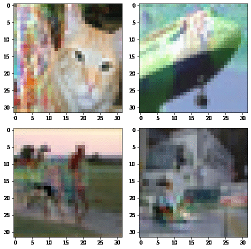

This code is a reproduction of the paper `Viewmaker Networks: Learning Views for Unsupervised Representation Learning`

[Alex Tamkin](https://www.alextamkin.com/), [Mike Wu](https://www.mikehwu.com/), and [Noah Goodman](http://cocolab.stanford.edu/ndg.html)

Paper link: [https://arxiv.org/abs/2010.07432](https://arxiv.org/abs/2010.07432)

## 0) Background

Viewmaker networks are a new, more general method for self-supervised learning that enables pretraining with _the same algorithm_ on a diverse range of different modalities—including images, speech, and sensor data.

Viewmaker networks _learn_ a family of data transformations with a generative model, as opposed to prior approaches which use data transformations developed by domain experts through trial and error.

Viewmakers are trained adversarially with respect to the pretraining loss—this means they are compatible with many different pretraining objectives. We present results for SimCLR and InstDisc, but viewmakers are compatible with any view-based objective, including MoCo, BYOL, SimSiam, and SwAV.

Some example distortions learned for images (each frame is generated with a different random noise input to the viewmaker)



## 1) Install Libraries and Dependencies

We used the PyTorch libraries for CUDA 10.1; you may have to adapt for your own CUDA version.

```
export PATH=~/anaconda3/bin:$PATH
git clone https://github.com/copperwiring/viewmaker-network-iclr.git
cd viewmaker-network-iclr

conda create -n viewmaker 
conda activate viewmaker
conda install pytorch==1.7.1 torchvision==0.8.2 cudatoolkit=10.1 -c pytorch
pip install -r requirements.txt
sudo apt-get remove virtualenv
```

## 2) Running experiments

Start by running
```console
source init_env.sh
```

**Note**: Our experiements will logged in wandb. Hence, before runnig the experiments;
1. Create a wandb account
2. Create a username when prompted.
3. Update `run_image.py` at line 67 with your wandb-username

```
    wandb.init(project='image', entity='<wandb-username>', name=config.exp_name, config=config, sync_tensorboard=True)
```
Example:
```
    wandb.init(project='image', entity='sulphur', name=config.exp_name, config=config, sync_tensorboard=True)
```
4. Save the file `run_image.py`

Now, you can run experiments for the different modalities (here image) as follows:

```console
python scripts/run_image.py config/image/pretrain_expert_cifar10_simclr.json
```
(If you see an error about wandb directory not created, create a directory `mkdir wandb` at the base path ad re-run the code)

You will see something like this:

<details>
    <summary> Toggle to see the output </summary> 

    (viewmaker) ➜  viewmaker git:(sy/test-viewmaker) ✗ python scripts/run_image.py config/image/pretrain_expert_cifar10_simclr.json
    Loaded configuration: 
    {'continue_from_checkpoint': None,
    'copy_checkpoint_freq': 5,
    'cuda': True,
    'data_loader_workers': 8,
    'data_params': DotMap(dataset='cifar10', default_augmentations='all'),
    'distributed_backend': 'ddp',
    'exp_base': None,
    'exp_name': 'pretrain_expert_cifar_simclr_resnet18',
    'gpu_device': 0,
    'loss_params': DotMap(t=0.07, name='simclr'),
    'model_params': {'out_dim': 128,
                    'projection_head': False,
                    'resnet': True,
                    'resnet_small': True,
                    'resnet_version': 'resnet18'},
    'num_epochs': 200,
    'optim_params': {'batch_size': 256,
                    'learning_rate': 0.03,
                    'momentum': 0.9,
                    'num_view_update': 1,
                    'patience': 1000,
                    'validate_freq': 1,
                    'weight_decay': 0.0001},
    'seed': 0,
    'system': 'PretrainExpertSystem',
    'validate': True}

    *************************************** 
        Running experiment pretrain_expert_cifar_simclr_resnet18
    *************************************** 

    [INFO]: Configurations and directories successfully set up.
    Files already downloaded and verified
    Files already downloaded and verified
    wandb: Currently logged in as: sulphur (use `wandb login --relogin` to force relogin)
    wandb: Tracking run with wandb version 0.12.9
    wandb: Syncing run pretrain_expert_cifar_simclr_resnet18
    wandb: ⭐️ View project at https://wandb.ai/sulphur/image
    wandb: 🚀 View run at https://wandb.ai/sulphur/image/runs/3597u6eo
    wandb: Run data is saved locally in /home/srishtiy/dev/viewmaker/wandb/run-20211221_224344-3597u6eo
    wandb: Run `wandb offline` to turn off syncing.

    GPU available: False, used: False
    [INFO]: GPU available: False, used: False
    TPU available: False, using: 0 TPU cores
    [INFO]: TPU available: False, using: 0 TPU cores
    /home/srishtiy/anaconda3/envs/viewmaker/lib/python3.6/site-packages/pytorch_lightning/utilities/distributed.py:37: UserWarning: Could not log computational graph since the `model.example_input_array` attribute is not set or `input_array` was not given
    warnings.warn(*args, **kwargs)

    | Name        | Type       | Params
    -------------------------------------------
    0 | model       | ResNet     | 11 M  
    1 | memory_bank | MemoryBank | 0     
    [INFO]: 
    | Name        | Type       | Params
    -------------------------------------------
    0 | model       | ResNet     | 11 M  
    1 | memory_bank | MemoryBank | 0     
    Epoch 0:   6%|██▍                                        | 13/235 [03:43<1:03:31, 17.17s/it, loss=-0.489,v_nu


</details>

This command runs viewmaker pretraining using cpu. If using GPU add `--gpu-device 0` at the end of the command (If you have a multi-GPU node, you can specify other GPUs.)

The `scripts` directory holds:
- `run_image.py`: for pretraining and running linear evaluation on CIFAR-10
- `run_meta_transfer.py`: for running linear evaluation on a range of transfer datasets, including many from MetaDataset
- `run_audio.py`: for pretraining on LibriSpeech and running linear evaluation on a range of transfer datasets
- `run_sensor.py`: for pretraining on Pamap2 and running transfer, supervised, and semi-supervised learning on different splits of Pamap2
- `eval_cifar10_c.py`: for evaluating a linear evaluation model on the CIFAR-10-C dataset for assessing robustness to common corruptions

The `config` directory holds configuration files for the different experiments,  specifying the hyperparameters from each experiment. The first field in every config file is `exp_base` which specifies the base directory to save experiment outputs, which you should change for your own setup.

You are responsible for downloading the datasets. Update the paths in `src/datasets/root_paths.py`. Currently few datasets e.g. CIFAR-10 is downloaded when the script is run (see `datasets.py`) but you can update `src/datasets` with other datasets.

Training curves and other metrics are logged using [wandb.ai](wandb.ai)
